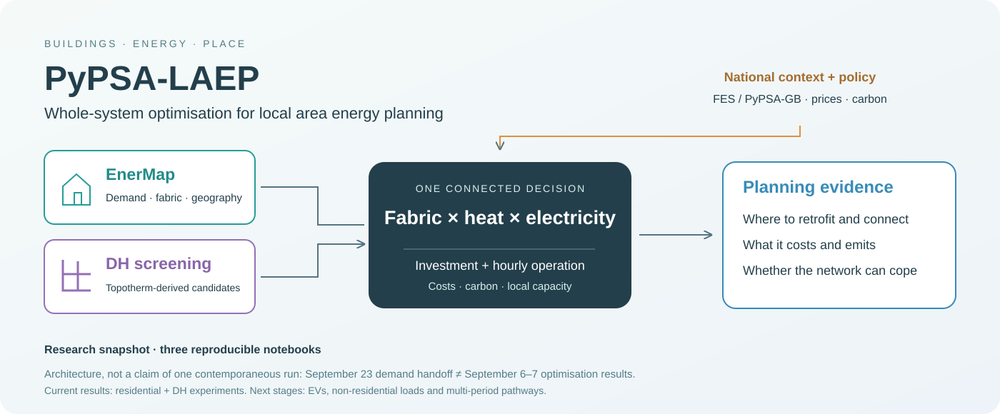
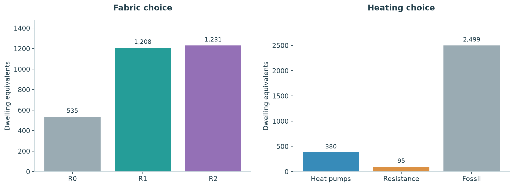
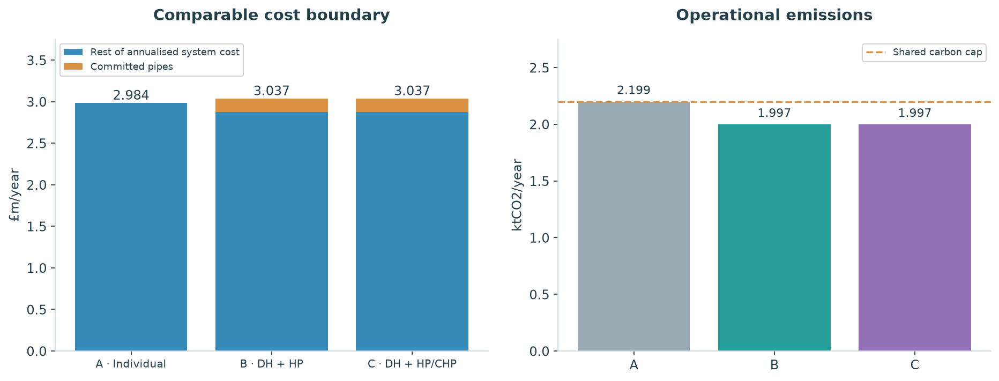

# PyPSA-LAEP

### Buildings, heating choices and the local energy system—considered together.

PyPSA-LAEP explores how building retrofit, heating technologies and local energy
infrastructure interact. EnerMap supplies spatially resolved building demand and
alternative fabric states. PyPSA brings those choices into a shared investment and
operational problem. District-heating candidates connect the spatial network work
to individual heating decisions.




## Start here

| Notebook | What you will see | Evidence boundary |
|---|---|---|
| [01 · Latest EnerMap handoff](notebooks/01_enermap_latest_handoff.ipynb) | Stock geography, R0/R1/R2 heat demand, hourly patterns, heat-pump COP and accounting checks | **23 Sep 2026**, 57,300 dwellings, 2,386 clusters; new uncalibrated median-archetype release |
| [02 · Residential whole-system study](notebooks/02_residential_whole_system.ipynb) | Retrofit/heating choices, costs, spatial uptake, network loading, replay and wider Guildford screening | **6 Sep 2026**, Westborough complete-zone case: 2,974 dwellings / 33 zones; hourly replay of **3 zones** |
| [03 · Guildford district heating](notebooks/03_guildford_district_heating.ipynb) | Street screening, candidate membership, pipe costs, individual versus DH choices, CHP and hourly operation | **6–7 Sep 2026**, candidate zone 4 / Stoughton: 2,534 dwellings / 15 electricity zones; residual replay shortfall disclosed |

**Important:** the September 23 EnerMap data are newer than the saved optimisation
results. Notebook 01 does not imply that Notebooks 02–03 have been rerun with that
handoff. They deliberately remain separate dated snapshots.

## A few findings worth opening the notebooks for

In the residential reference case, the model selects fabric measures for about **82%**
of dwelling equivalents, reducing useful space heat by **28.6%**. It does not choose
universal electrification: the result depends on existing equipment, fuel and carbon
prices, network constraints and technology costs.



For the DH candidate, approximately **831 dwelling equivalents** connect to a
**4.96 MWth central heat pump**. Adding CHP as an option does not lead to CHP investment.
Once committed pipes are included, the central-HP DH case costs about **1.77% more**
than individual-only heating but emits about **9.17% less** under the shared carbon cap.



These are model-dependent results, not procurement prices or recommendations for
particular households. The DH replay still has **73.2 kWh of unmet electricity**,
above its **1 kWh** feasibility tolerance. The wider town aggregation also exceeds
the assumed shared GSP headroom. Both limitations are shown, not hidden.

## Read without running a model

Open the `.ipynb` links above on GitHub: figures and outputs are already saved.
If the notebook viewer is unavailable, download the repository and open the matching
files via [reports/index.html](reports/index.html) in a browser. These HTML reports contain their plotted
outputs. Code is hidden in the reader reports and retained in full in the notebooks.
They are downloadable files, not a public website; no public Pages deployment
has been enabled.

## Reproduce the figures

Use Python 3.11 or newer in a fresh environment:

```sh
python -m venv .venv
# Activate .venv using the command for your operating system.
python -m pip install -r requirements.txt
python scripts/execute_notebooks.py
python -m unittest discover -s tests -v
```

Alternatively run `jupyter lab` and execute a notebook from top to bottom. All paths
resolve relative to this repository. **No solver, PyPSA installation, private source
folder, API key or network download is required to reproduce the plotted results.**
This reproduces the presentation from the included snapshots, not the original
optimisation. Requirements describe a compatible environment; the exact environment
used for this release is recorded in [docs/execution_environment.json](docs/execution_environment.json).

## Repository guide

```text
notebooks/   Three executed research narratives
data/        Compact source snapshots and documented aggregations
assets/      Reusable charts and framework diagram
reports/     HTML versions, with saved outputs
src/         Small, inspectable plotting helpers
scripts/     Snapshot preparation, notebook sources and execution
tests/       Accounting, scope and output checks
docs/        Scope, units, limitations and SHA-256 source provenance
```

`scripts/prepare_snapshot.py` documents the transformations used to package the
original research outputs. Rebuilding those snapshots requires the author's source
folders; **viewing or executing these notebooks does not**. `scripts/build_notebooks.py`
is the editable narrative source; rebuilding clears outputs until execution is run.

## What remains in development

EVs and non-residential demand are not presented as completed analysis. The next
milestones are the latest-demand rerun, consistent cost years, joint upstream network
constraints, full-scope replay and then multi-period pathways. “Whole system” describes
the integration within the declared model boundary—not a claim that every sector,
constraint or uncertainty has already been represented.

Read the [scope, caveats and unit conventions](docs/scope.md) before using the numbers.
Source hashes and transformations are in [the provenance manifest](docs/source_manifest.json).
Keep source-derived data private until licensing and publication permissions are reviewed.

---

**EnerMap → PyPSA-LAEP · Research snapshot packaged 27 September 2026**


