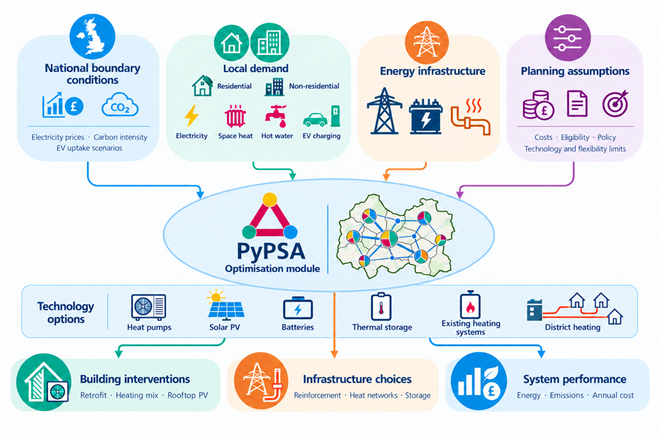

# PyPSA LAEP results



Explore Guildford's local energy planning results in three notebooks:

1. [2025 baseline](01-2025-baseline.ipynb)
2. [2035 without district heating](02-2035-without-DH.ipynb)
3. [2035 with district heating](03-2035-with-DH.ipynb)

Charts cover demand and supply, dispatch, heating, retrofit, storage, costs, emissions and network capacity. Maps use OpenStreetMap. Change `AREA` and `DAY` in the first cell to explore.

```bash
pip install -r requirements.txt
jupyter lab
```

Run from this repository's root. Saved chart outputs are viewable on GitHub; run the notebooks for interactive maps. No optimiser or original model checkout is required.

Basemaps © [OpenStreetMap contributors](https://www.openstreetmap.org/copyright), ODbL.
